# github远程库操作

## 1. github操作

### 1.1 仓库操作

- **创建仓库**：在 GitHub 上点击 `New repository`
- **克隆仓库**：`git clone <repo_url>`
- **删除仓库**：在仓库设置中选择 `Delete this repository`
- **Fork 仓库**：点击右上角 `Fork`，复制到自己账户

------

### 1.2 分支与协作

- **在 GitHub 上创建分支**：点击 `Branch: main` → 输入新分支名 → `Create branch`
- **保护分支**：在仓库 `Settings → Branches → Add rule` 设置保护规则
- **分支权限**：可以限制谁能 push 到 main 分支

------

### 1.3 Pull Request (PR)

- **创建 PR**：在 GitHub 上点击 `Pull requests` → `New pull request`
- **合并方式**：
  - Merge Commit
  - Squash and Merge
  - Rebase and Merge
- **代码审查 (Review)**：团队成员可以进行 Review，提出修改意见

📌 **PR 流程图**

```mermaid
sequenceDiagram
    participant Dev as 开发者
    participant GitHub as GitHub
    participant Maintainer as 维护者

    Dev->>GitHub: 提交 PR
    Maintainer->>GitHub: 代码审查 (Review)
    Maintainer->>GitHub: 合并 (Merge/Squash/Rebase)
    GitHub->>Dev: 通知合并结果
```



------

### 1.4 Issue 管理

- **创建 Issue**：用于 Bug、需求、任务
- **标签 (Label)**：用于分类，例如 `bug`、`enhancement`
- **分配 (Assignee)**：分配给团队成员
- **里程碑 (Milestone)**：规划版本目标

### 1.5 Release 管理

1. 在 GitHub 仓库 → `Releases` → `Draft a new release`
2. 选择一个 **Tag**（或新建）
3. 填写 Release Notes（发布说明）
4. 发布 Release

------

### 1.6 GitHub Actions (CI/CD)

- **作用**：自动化测试、部署、构建
- **配置文件**：`.github/workflows/ci.yml`

示例：

```yaml
name: CI
on: [push, pull_request]
jobs:
  build:
    runs-on: ubuntu-latest
    steps:
      - uses: actions/checkout@v2
      - name: Setup Node.js
        uses: actions/setup-node@v2
        with:
          node-version: 16
      - run: npm install
      - run: npm test
```

------

## 2. Git 工作流

### 2.1 Feature Branch Workflow

```mermaid
gitGraph
    commit id: "main"
    branch feature
    commit id: "feature 开发"
    checkout main
    merge feature
```



------

### 2.2 Git Flow Workflow

```mermaid
graph TD
    A[main 分支] -->|创建| B[develop 分支]
    B -->|创建| C[feature 分支]
    C -->|完成后合并| B
    B -->|准备发布| D[release 分支]
    D -->|测试通过后合并| A
    D -->|同时合并| B
    A -->|紧急修复| E[hotfix 分支]
    E -->|修复后合并| A
    E -->|同时合并| B
```



------

### 2.3 Forking Workflow

```mermaid
sequenceDiagram
    participant Dev as 开发者
    participant GitHub as GitHub
    participant MainRepo as 主仓库

    Dev->>GitHub: Fork 主仓库
    Dev->>Dev: 开发新功能 (feature 分支)
    Dev->>GitHub: 提交到 Fork 仓库
    Dev->>MainRepo: 提交 Pull Request
    MainRepo->>Dev: 审查 & 合并
```



------

## 3. 实践案例

### 开发新功能

```bash
git checkout -b feature/login
# 开发功能
git add .
git commit -m "feat: 新增登录功能"
git push origin feature/login
# GitHub → 提交 PR → 合并到 develop
```

### 发布版本

```bash
git checkout main
git merge develop
git tag -a v2.0.0 -m "发布版本 2.0.0"
git push origin main
git push origin v2.0.0
# GitHub → Releases → Draft new release → 选择 v2.0.0
```

------

## 4. 最佳实践

- 提交信息遵循 **Conventional Commits**
  - `feat: 新功能`
  - `fix: 修复 bug`
  - `docs: 文档更新`
  - `refactor: 代码重构`
- 功能必须用分支，避免直接在 main 提交
- 使用 Pull Request 进行代码审查
- 给版本发布打 **Tag + Release**
- 使用 GitHub Actions 实现自动化测试/部署

------

## 5. 参考资料

- [Pro Git 中文版](https://git-scm.com/book/zh/v2)
- [GitHub Docs](https://docs.github.com/)
- [Atlassian Git Workflow](https://www.atlassian.com/git/tutorials/comparing-workflows)